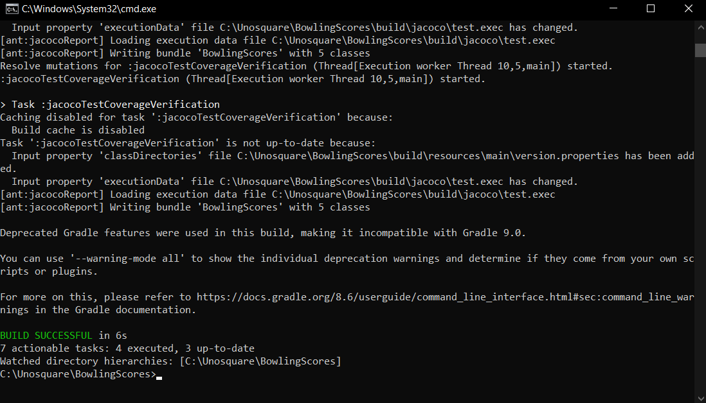
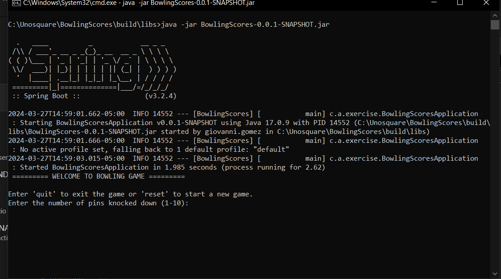

# BowlingScores
A Command Line app to run scores in bowling

## How to run the App?
1. Before running the app you can type `gradle clean build`
2. Then type `gradle :bootRun`
3. Otherwise, go to `./build/libs` and then type `java -jar BowlingScores-0.0.1-SNAPSHOT.jar`

## How to run the test?
1. Type `gradle clean build`
2. Then, type `gradle test -i`

## How to check the coverage?
1. Once it was executed command `gradle clean build`, 
2. Go to `./build/jacocoHtml/index.html`
3. `index.html` will be open in default browser

